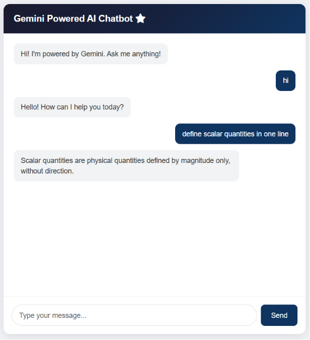

# AI Chatbot Powered by Gemini

An AI-powered chatbot built using Google's Gemini API and vanilla JavaScript.

## Preview

## Features
- Real-time AI responses
- Clean and simple UI
- Powered by Google Gemini 2.5 Flash
- No backend required

## Built With
- HTML & CSS
- Vanilla JavaScript
- Google Gemini API (Free Tier)

## How to Run
1. Get a free Gemini API key from [aistudio.google.com](https://aistudio.google.com)
2. Clone or download this repository
3. Open `index.html`
4. Replace `YOUR_API_KEY_HERE` with your actual key
5. Open in browser and start chatting!

## Author
- Imaan Shoaib : Software Engineering Student
- LinkedIn: linkedin.com/in/imaan-shoaib-446029379
- GitHub: https://github.com/Amycodes2025
